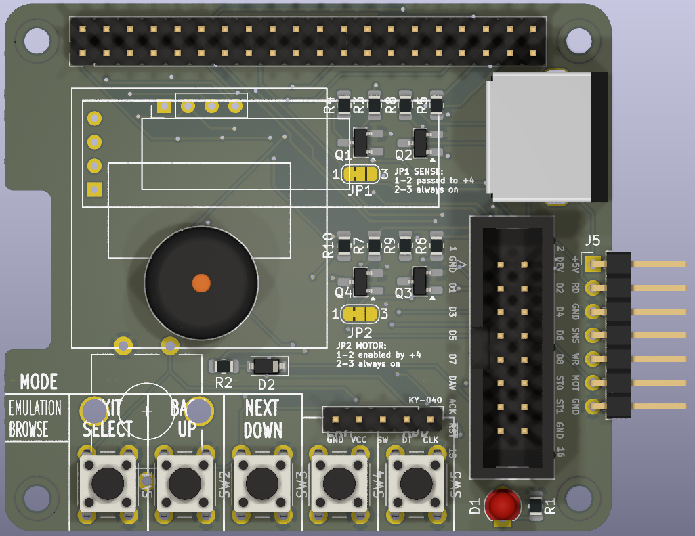
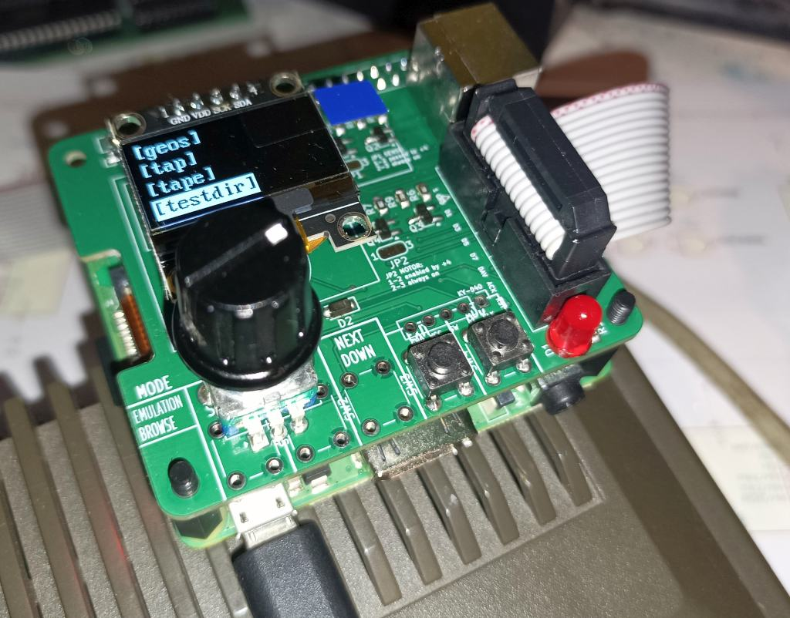
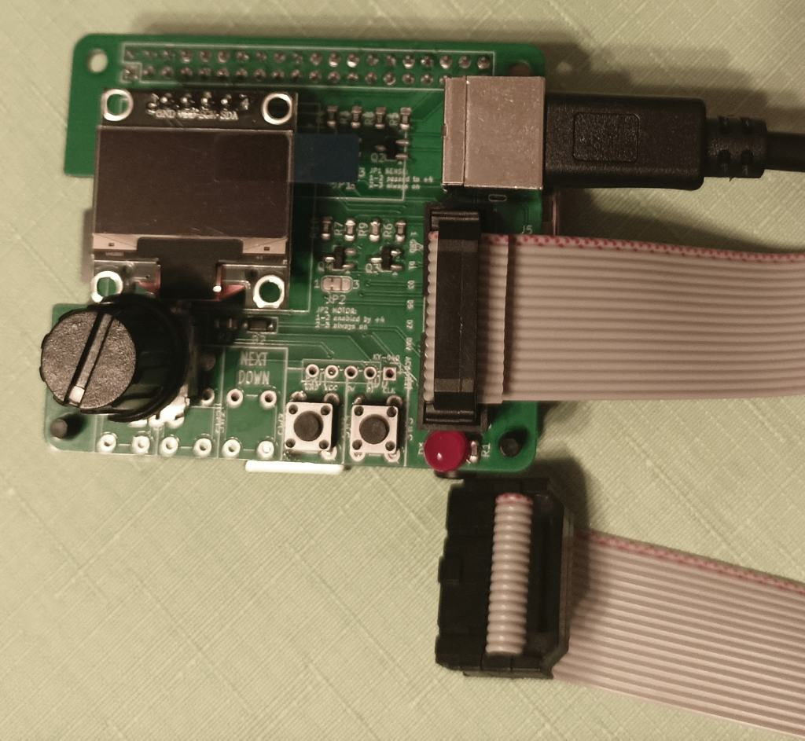
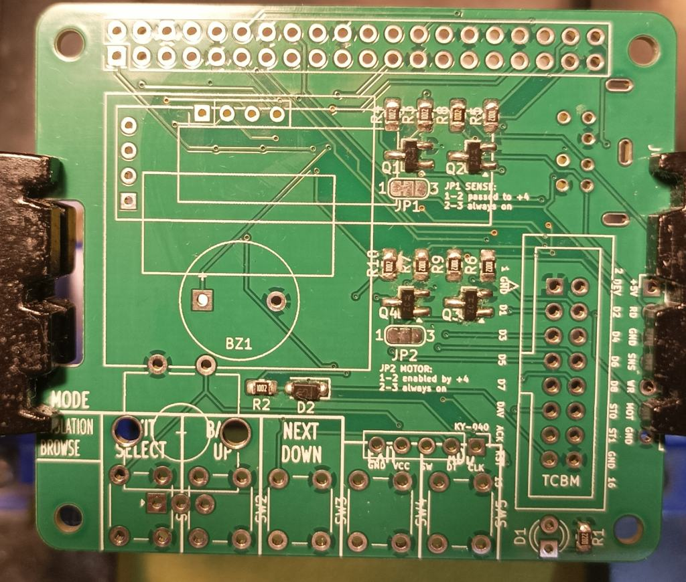

# PI1551 HAT

A minimalistic HAT for Raspberry Pi 3A/3B/3B+ that gives you low-cost **1551 floppy emulation** (and optionally **TAP tape playback**) for Commodore C16/C116 or Plus/4. You build only what you need: the core is a few parts; display, controls, and TAP support are optional add-ons.

**Warning: For [tcbm2sd](https://github.com/ytmytm/plus4-tcbm2sd) ONLY. Do not connect this HAT to a real 1551 drive. The circuit is not 5V-tolerant and can damage the Raspberry Pi.**

---

## What to build (at a glance)

| Goal | You need |
|------|----------|
| **1551 emulation only** | PCB + required parts below + 16-wire ribbon cable + [tcbm2sd](https://github.com/ytmytm/plus4-tcbm2sd). No display, no buttons (disk commands only or HDMI+USB keyboard). |
| **1551 + menu on device** | Above + **one of**: 5 buttons, or 2 buttons + rotary encoder (ALPS EC11E or KY-040). Optionally add OLED and/or LED. |
| **1551 + TAP playback** | Above + TAP_READ block (Q2, R5, R8) + MiniDIN-7 socket or J5 header + cable to computer. Rest of TAP circuit is optional (see [TAP playback](#tap-playback)). |

Everything not in the “required parts” list is optional. You can add options later.

---

## Origin

Cloned from [PI1541 Hat](https://github.com/tebl/C64-Pi1541-module), adapted for 1551 and tape playback.

## Software

Firmware: [Pi1551](https://github.com/ytmytm/Pi1551) (branch `pi1551`).

## Hardware

The [Releases](https://github.com/ytmytm/Pi1551-HAT/releases) section contains all the files you need for manufacturing the PCB with SMD parts populated. That includes Gerber files, BOM with JLCPCB part numbers and SMD part positions.

- [Schematic PDF](plots/RPi_Hat.pdf)
- [Gerbers](plots/)

### Required parts (1551 emulation)

- 40×2 female header for Raspberry Pi GPIO
- 2×8 (16-pin) male IDC connector for ribbon cable to [tcbm2sd](https://github.com/ytmytm/plus4-tcbm2sd)
- D2: Schottky diode (BAT54, BAS40, BAT43 or 1N5819) — protects the Pi
- R2: 10K resistor (with D2)

Plus a **straight 16-wire ribbon cable**. Connections are 1:1; both ends must be crimped the same way. I recommend crimping the cable the same way as in the photo above, with both connectors identical — it makes cable routing easier on both ends.

You can order the PCB with SMD parts pre-populated:

### Optional: display

- OLED: SSD1306 128×64 or 128×32, or SH1106 128×64 (SH1106 is large - there is no room for rotary encoder, use 5 buttons instead).
- Pinout selectable by solder jumpers: GND/VCC/SCL/SCL (default) or VCC/GND/SCL/SCL.

### Optional: drive LED

- 3 mm or 5 mm LED + R1 (e.g. 220 Ω).

### Optional: audio

- 3 V buzzer with built-in oscillator.

### Optional: controls (pick one set)

- **Option A:** 5× 6×6 mm tact switches (SW1–SW5).
- **Option B:** 2× 6×6 mm tact switches (SW4-SW5) + rotary encoder (ALPS EC11E or a KY-040 module).

### TAP playback

To play TAP files you need:

- **TAP_READ block:** Q2, R5, R8 (required for tape in).
- **Connector:** MiniDIN-7 socket (J4) **or** 1×7 pin header (J5) to solder the cable.
- **Cable:** At least TAP_READ and GND; one end must be Mini-DIN-7 male.

If you intend to solder the cable yourself, the order of signals on J5 is such that it's easy to solder a piece of ribbon cable to a Mini-DIN-7 plug by going around the perimeter (see schematic for both pinouts). 

The rest of the TAP circuit is optional, but recommended:

- **TAP_SENSE** (Q1, R3, R4): lets the computer see “tape PLAY pressed”. If you omit it, close jumper JP1 so SENSE is always active.
- **MOTOR** (Q4, R7, R10): lets the computer control motor line. If you omit it, close JP2 so motor is always enabled (fine for Pi1551).

You can also leave all parts in and configure behaviour in the [Pi1551](https://github.com/ytmytm/Pi1551) config.

*If your Plus/4 has a 6510 CPU swap, it cannot drive the MOTOR line (see [this note](https://hackjunk.com/2017/06/23/commodore-16-plus-4-8501-to-6510-cpu-conversion/)). You can still have MOTOR active all the time via the [Pi1551](https://github.com/ytmytm/Pi1551) configuration file.*

**TAP_WRITE** (Q3, R6, R9) is on the PCB for future use when Pi1551 supports tape write.

## PCB

The board is a mixture of THT and SMD parts.

Don't be afraid of SMD parts, I have used larger footprints that are more friendly for hand soldering. You need tweezers, a steady hand, iron with a fine tip and a 0.5mm solder. Use the flux generously.

Note the D2 diode orientation - the stripe is on the same side as the closed silkscreen, towards the TCBM connector. 

For convenience, the majority of resistors (R2-R10) are all the same. Use any value in the 1K-10K range you have at hand.

You might find that soldering those four SMD transistors, ten resistors and one diode is faster than their THT counterparts.

## BOM

Count of optional parts in brackets.s

| Reference | Item                                   | Count |
| --------- | -------------------------------------- | ----- |
| J1        | 2x20 pin long female header            |     1 |
| J2        | 2x8 pin IDC 16P socket                 |     1 |
| J3        | KY-040 rotary encoder module           |    (1)|
| J4        | MiniDIN-7 female socket                |    (1)|
| J5        | 1x7 pin long male header               |    (1)|
| BZ1       | Buzzer (5mm / 7mm pin spacing), 3V     |    (1)|
| IC1       | SSD1306 OLED-display 128x64 (0.96")    |    (1)|
| IC2       | SSD1306 OLED-display 128x32 (0.91")    |    (1)|
| SW1-SW5   | Momentary push button, 6x6mm           |    (5)|
| SW6       | ALPS EC11E rotary encoder or similar   |    (1)|
| D1        | 3mm / 5mm LED (e.g. red for authenticity)               |    (1)|
| D2        | Schottky diode: BAT54, 1n5819, BAT43, etc. |    1 |
| R1        | 100-220 Ohm (for LED)                  |    (1)|
| R2-R10    | 1K-10K Ohm (R2 required; rest optional)|  1+(9)|
| Q1-Q4     | MMBT3904 / 2N3904 transistors          |    (4) |

